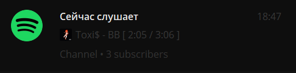
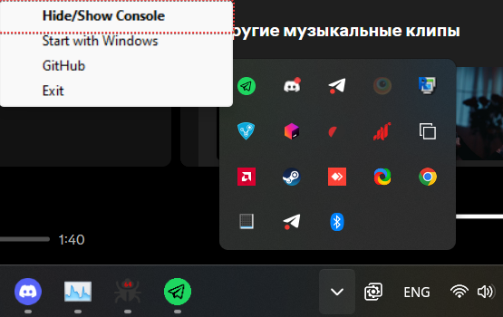
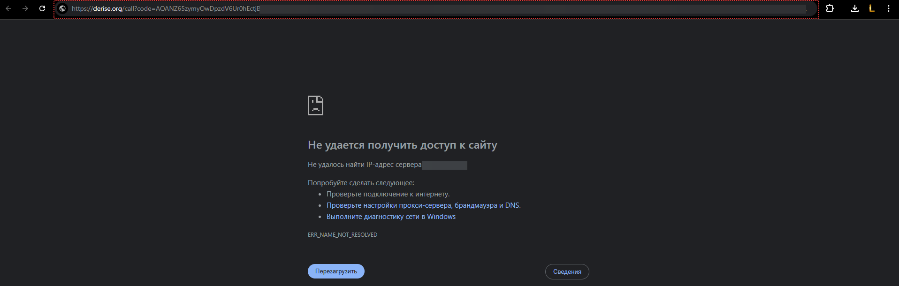

Простой и быстрый скрипт для отображения вашей музыкальной активности в Spotify.

Большое спасибо [altfoxie](https://github.com/altfoxie) за идею.

[FozerG](https://github.com/FozerG/) за примерное представление как работает фоновый режим.



## Установка

Основной рассчёт - на пользователей Windows. Файл .exe вы сможете найти в релизах. 

Однако, ничего не мешает вам запустить скрипт на чистом Python. 

В каком-то смысле, это даже плюс - вы сможете дать возможность скрипту работать бесперебойно, установив подобный скрипт на сервер посредством Python.

```
$ pip install -r requirements.txt

$ python3 Startup.py
```

## Запуск

При первом запуске создаётся файл `config.ini` с настройками. 

| Группа     | Описание                                  |
|------------|-------------------------------------------|
| `SP_AUTH`  | Содержит в себе настройки для API-клиента |
| `TG_CONF`  | Настройки для Telegram.                   |
| `GENERAL`  | Содержит в себе общие настройки.          |


### Фоновый режим

Для того, чтобы скрыть приложение в фоновый режим, вам необходимо скрыть приложение через Tray:



### Настройки Telegram

Текст обновляется и создаётся в сообщенях чата.

Предполагается использование вместе с привязкой канала к профилю: таким образом, текст будет виден при просмотре профиля.

| Параметр    | Описание                                    |
|-------------|---------------------------------------------|
| `bottoken`  | Токен бота [отсюда](https://t.me/BotFather) |
| `channelid` | ID канала (начинается с -100)               |

### Настройки Spotify

Создать приложение можно [тут](https://developer.spotify.com/dashboard)

Обратите внимание, что при первом запуске, скрипт потребует от вас ввести ссылку, на которую вас перевели после входа в приложение через Spotify. Эта ссылка будет в строке URL.



Для того, чтобы вы смогли без проблем получить токен, вам будет необходимо установить в приложении Spotify, а также в конфиге любой __недействительный__ URL. К примеру, https://derise.org/

| Параметр        | Описание                                              |
|-----------------|-------------------------------------------------------|
| `client_id`     | ID приложения (Можно получить из настроек приложения) |
| `client_secret` | Токен приложения (Также можно получить в настройках)  |
| `callback_url`  | URL, который вы ввели в настройках приложения.        |

### Общие настройки

| Параметр          | Описание                                  |
|-------------------|-------------------------------------------|
| `NotPlaying`      | Сообщение, когда ничего не играет         |
| `RefreshInterval` | Интервал обновления времени прослушивания |
