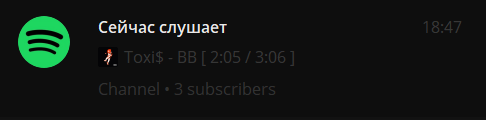

# Telefy

Простой и быстрый скрипт для проецирования вашей музыкальной активности в Spotify.



## Установка

Основной рассчёт - на пользователей Windows. Файл .exe вы сможете найти в релизах. 

Однако, ничего не мешает вам запустить скрипт на чистом Python.

```
$ pip install -r Startup.py

$ python3 Startup.py
```

## Запуск

При первом запуске создаётся файл `config.ini` с настройками.

| Группа     | Описание                                  |
|------------|-------------------------------------------|
| `SP_AUTH`  | Содержит в себе настройки для API-клиента |
| `TG_CONF`  | Настройки для Telegram.                   |
| `GENERAL`  | Содержит в себе общие настройки.          |


### Настройки Telegram

Текст обновляется и создаётся в сообщенях чата.

Предполагается использование вместе с привязкой канала к профилю: таким образом, текст будет виден при просмотре профиля.

| Параметр    | Описание                                    |
|-------------|---------------------------------------------|
| `bottoken`  | Токен бота [отсюда](https://t.me/BotFather) |
| `channelid` | ID канала (начинается с -100)               |

### Настройки Spotify

Создать приложение можно [тут](https://developer.spotify.com/dashboard)

| Параметр          | Описание                                              |
|-------------------|-------------------------------------------------------|
| `client_id`       | ID приложения (Можно получить из настроек приложения) |
| `client_secret`   | Токен приложения (Также можно получить в настройках)  |

### Общие настройки

| Параметр          | Описание                                  |
|-------------------|-------------------------------------------|
| `NotPlaying`      | Сообщение, когда ничего не играет         |
| `RefreshInterval` | Интервал обновления времени прослушивания |
